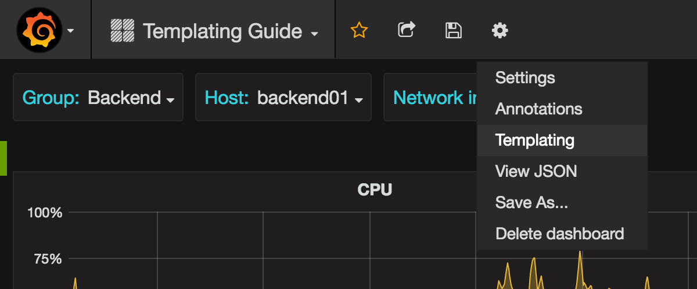
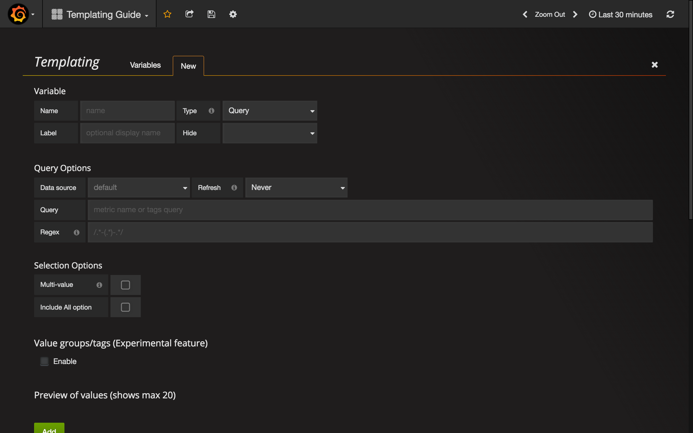
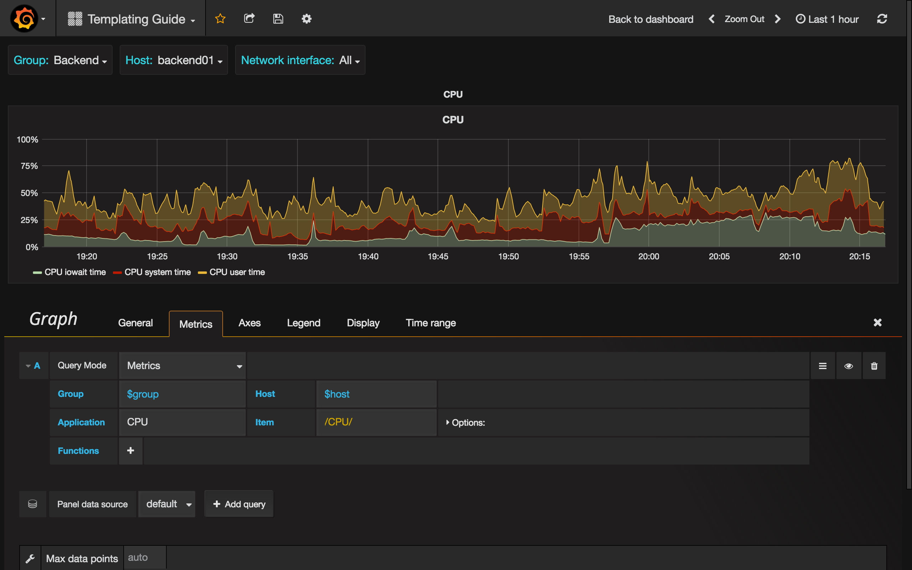

# Templating Guide
You can use template variables for creating highly reusable and interactive dashboards. General idea of templating is allow Grafana to get different metrics from data source and provide a way to change it on the fly without modifying dashboard. In case of Zabbix it means that you can get list of Host Groups, Hosts, Applications or Items and add it as a variables.

## Creating Variable
To create template variable click the cog icon on the top navigation bar and choose _Templating_.



When you click _New_ button, you'll see template variable editor. It contains these sections:



### Variable

**Name**  
Name of the variable. You should use this name in queries.

**Label**  
Visible label for variable. Use when you want to display different name on dashboard. For instance, _Host Group_ instead *host_group*.

**Type**  
By default _Query_ type is selected. It means that Grafana asks data source for values of variable. But there are some other types: _Interval_ (just a time interval), _Data source_ (You can switch data source, for example, if you have more than one Zabbix instance and each added into Grafana as data source), _Custom_ (you can set any predefined values for variable) and _Constant_.

### Query Options

**Data source**  
Data source used for querying variable values.

**Refresh**  
When to update the values of this variable.

**Query**  
Query string.

**Regex**  
Use regex if you need to filter values or extract a part of value.

### Selection Options

**Multi-value**  
Enable, if you want to select multiple values at the same time.

### Value groups/tags (Experimental feature)

## Query Format
Template variable query in Zabbix data source is a string which contains 4 parts divided by period (`.`):
```
{host group}.{host}.{application}.{item name}
```
For example, `Zabbix servers.Zabbix server.CPU.*`

Each part can be a name of corresponding metric or `*`, which means _all metrics_.

Examples:

 - `*` returns list of all available Host Groups
 - `*.*` all hosts in Zabbix
 - `Network.*` returns all hosts in group Network
 - `Linux servers.*.*` returns all applications from hosts in Linux servers group
 - `Linux servers.backend01.CPU.*` returns all items from backend01 belonging to CPU application.

You can use another variable as a part of query. For instance, you have variable _group_, which returns list of host groups and want to use it for querying hosts in selected group only. Here's a query for this case:
```
$group.*
```

## Variables Usage

When you create a variable, you can use it as a part of data source query. Grafana also supports variables in different places like panel's and row's titles, Text panel's content, etc.



> Note, that you should add `$` sign before variable's name (**$host** for _host_ variable).

See more about templating in [Grafana docs](http://docs.grafana.org/reference/templating)
